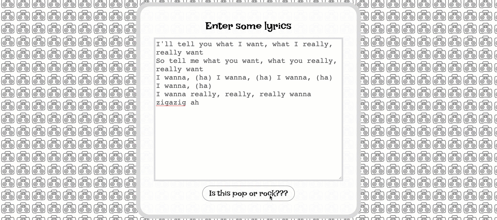

# Create your own BERT web app — End-to-end tutorial

This is the repo for the Peltarion Platform tutorial [Create your own BERT web app](https://peltarion.com/knowledge-center/tutorials). We will show you how to build an app that use a pretrained and fine tuned BERT model to classify lyrics as pop or rock. 

You could use this demo for similar problems, like for important things like joke classifiers.

**Tutorial steps**

This tutorial will guide you through three main steps:
1. Preprocess the data in a notebook.
1. Build, train and deploy a BERT model in the Peltarion Platform.
1. Create a web app with the content in this repo.

### Clone and download this repository

Start by cloning and download this repo to your computer.

## Preprocess data in a notebook

Every deep learning project start with finding and preprocessing the data. For this tutorial tutorial we have created the [pop_rock_classifier.ipynb](data_preparation/pop_rock_classifier.ipynb) notebook. Follow the instructions in the notebook to create a well balanced dataset that is fit for the platform.

### Open the notebook

In a terminal navigate to the _/demo-pop-or-rock/data_preparation/_ directory and run:

`jupyter notebook pop_rock_classifier.ipynb`

## Build, train, and deploy model on the Peltarion Platform

If you haven't yet, sign up to the Peltarium Platform. The community edition is free and users automatically receive:
* Access for up to two users
* 50 GPU hours for FREE
* 50 GB storage for FREE

Navigate to the [Create your own BERT web app](https://peltarion.com/knowledge-center/tutorials) on the Peltarion Knowledge center. Follow the instructions on how to:
* Import the dataset you created in the [pop_rock_classifier.ipynb](data_preparation/pop_rock_classifier.ipynb) notebook
* Quickly and effortlessly create a text _pop or rock_ model using our prebuilt BERT snippet
* Deploy the trained model.

# Create a web app with the content in this repo

Once you have deployed your trained _pop or rock_ model follow the instructions below to create a web app that uses the model.

## Getting started - Configuration

Create a configuration file based on our example config file: [`sample-config.json`](sample-config.json). Name this file `app-config.json`.

Create a `config/`folder and save your new configuration file there. We have entered the folder `config/` in `.gitignore` so it's safe to put config files there. 

### Copy and paste deployment URL and token

Go to the Deployment view of your project and find the deployment's URL and Token.

Copy the deployment URL and token and paste them in the newly created configuration file `app-config.json`.

## Start the app with npm

In a terminal navigate to the directory where you cloned this repository.

Run:

`npm install` _(if needed)_

`npm start` (_will use the app-config.json you created above_)

## Test the classifier in a browser

Open a browser and enter the address the [https://127.0.0.1:3000](https://127.0.0.1:3000). 

Go search the internet for your favourite pop or rock lyric. Copy paste in the web app and hit the submit button. Is your model correct?

## Additional info

### Docker

We have provided a [dockerfile](Dockerfile) that is useful if you prefer to run the application without installing node or to host it in the cloud using services like e.g., [Google Cloud Run](https://cloud.google.com/run/) or similar.

In the package.json there are a few commands that will help you with various Docker tasks.

### Services

Since the app integrate with other services that requires secret tokens, we cannot call these services directly from the frontend. 
Therefore, we need a dedicated API for the service. This is also good because we can manage some degree of pre/post-processing and optimizations if needed (e.g., truncation of the text, caching of results, etc.).

There are two components:
1. API
2. Client HTML & Javascript code

Currently both components will be served by NodeJS. In a live scenario you may consider using a high performant web server like nginx for the static files. (Aesthetically it may also be a prettier solution this way because we separate the concerns - UI vs API). Anyway, we keep it simple for now. One service it is. 

<!-- 
### Limitations

Unfortunately the model does not at all perform well at the moment. 

## License -->
